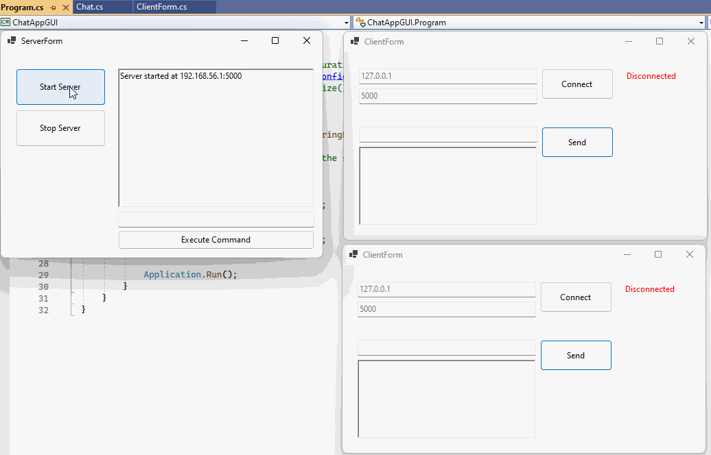

# ChatAppGUI

ChatAppGUI is a Windows Forms chat application that lets users communicate in real time. Clients can connect to a server, send private messages, and broadcast messages to everyone. The easy-to-use interface allows users to set nicknames, receive messages clearly, and chat directly with others. It's perfect for personal or small group conversations.



### Server Commands

```bash
# Send a message to all clients.
# BROADCAST: Your message here

# Send a message to a specific client.
# SEND: ClientAlias: Your message here

# Disconnect a specific client.
# DISCONNECT: ClientAlias
```

### TCP Overview
Use this example to provide a basic understanding of how to set up a simple TCP server and client using TcpListener and TcpClient in C#.

```csharp
/* Program.cs */

class Program
{
    static void Main(string [] args)
    {
        Console.WriteLine("Running TCP Demo");
        
        if (args.Length > 0)
        {
            if(args[0] == "server"){
                SimpleServer server = new SimpleServer();
                server.load();
            }
            else if(args[0] == "client"){
                SimpleClient client = new SimpleClient();
                client.load();
            }
        }
    }
}

```

The SimpleServer.cs code sets up a TCP server that listens for incoming client connections on port 5000. It initializes a TcpListener, waits for a client to connect, and reads a message from the client, displaying it in the console. After receiving the message, the server sends an echo response back to the client and closes the connection.

```csharp
/* Server Code */
using System;
using System.Net;
using System.Net.Sockets;
using System.Text;

class SimpleServer
{
    public void load()
    {
        TcpListener server = new TcpListener(IPAddress.Any, 5001);
        server.Start();
        Console.WriteLine("Server started...");

        while (true)
        {
            TcpClient client = server.AcceptTcpClient();
            Console.WriteLine("Client connected.");
            
            NetworkStream stream = client.GetStream();
            byte[] buffer = new byte[1024];
            int bytesRead = stream.Read(buffer, 0, buffer.Length);
            string message = Encoding.UTF8.GetString(buffer, 0, bytesRead);
            Console.WriteLine($"Received: {message}");

            // Echo the message back to the client
            byte[] msgBuffer = Encoding.UTF8.GetBytes("Echo: " + message);
            stream.Write(msgBuffer, 0, msgBuffer.Length);
            Console.WriteLine("Message sent back to client.");

            client.Close();
        }
    }
}
```

SimpleClient.cs code connects to the TCP server running on localhost (127.0.0.1) at port 5000. It establishes a connection, sends a greeting message to the server, and then waits for the server's response. Once received, it displays the echoed message in the console before closing the connection. Together, these codes demonstrate basic client-server communication using TCP in C#.

```csharp
/* Client Code */
using System;
using System.Net.Sockets;
using System.Text;

class SimpleClient
{
    public void load()
    {
        TcpClient client = new TcpClient("127.0.0.1", 5001);
        Console.WriteLine("Connected to the server.");

        NetworkStream stream = client.GetStream();
        string message = "Hello, Server!";
        byte[] msgBuffer = Encoding.UTF8.GetBytes(message);
        stream.Write(msgBuffer, 0, msgBuffer.Length);
        Console.WriteLine($"Sent: {message}");

        // Receive the response from the server
        byte[] buffer = new byte[1024];
        int bytesRead = stream.Read(buffer, 0, buffer.Length);
        string response = Encoding.UTF8.GetString(buffer, 0, bytesRead);
        Console.WriteLine($"Received: {response}");

        client.Close();
    }
}
```

### How to run:
1. Compile and run the server code first. It will start listening for client connections.
2. Compile and run the client code. It will connect to the server and send a message.
3. The server will display the message received from the client and echo it back. Then the client will display the response received from the server.

### References
* [C# Sockets - Tcp Listener Class](https://learn.microsoft.com/en-us/dotnet/api/system.net.sockets.tcplistener?view=net-8.0)
* [C# Multi-Threaded Server and Client](https://medium.com/@hafeezullah2023/mastering-c-tcp-client-and-multi-threaded-server-your-comprehensive-guide-to-effective-4c0d29f2b0cd)
